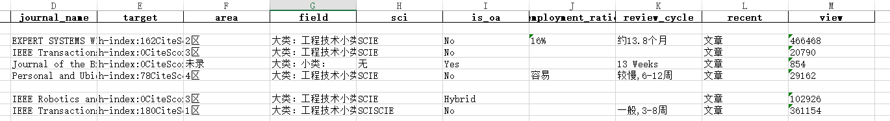

# 脚本汇总

> 学术性的脚本基本来自我导师，因为不想搬砖，就让python替我搬砖吧！

## 学术脚本

### 提取论文Reference的期刊/会议信息

**使用说明**

需求：

● 参考论文的期刊

● 筛选有没有周期短的期刊

overleaf参考论文示例：

> 每个之间要有空格


```
@article{yu2019review,
  title={A review of recurrent neural networks: LSTM cells and network architectures},
  author={Yu, Yong and Si, Xiaosheng and Hu, Changhua and Zhang, Jianxun},
  journal={Neural computation},
  volume={31},
  number={7},
  pages={1235--1270},
  year={2019},
  publisher={MIT Press One Rogers Street, Cambridge, MA 02142-1209, USA journals-info~…}
}

@article{huang2015bidirectional,
  title={Bidirectional LSTM-CRF models for sequence tagging},
  author={Huang, Zhiheng and Xu, Wei and Yu, Kai},
  journal={arXiv preprint arXiv:1508.01991},
  year={2015}
}

@inproceedings{sundermeyer2012lstm,
  title={LSTM neural networks for language modeling},
  author={Sundermeyer, Martin and Schl{\"u}ter, Ralf and Ney, Hermann},
  booktitle={Thirteenth annual conference of the international speech communication association},
  year={2012}
}
```

要求安装库：

```properties
pandas~=1.5.1
requests~=2.28.1
beautifulsoup4~=4.11.1
lxml~=4.9.1
openpyxl~=3.0.10
```

创建一个python脚本:

> 把源码放入到和ref.bib同级位置的地方

[查看详细代码](1-extra_letpub.py)

结果示例：



#### 版本更新说明

1.0

- 2022年11月22日 12点22分 增加日志、修复部分问题
- 2022年11月22日 00点17分 第一次初始化脚本